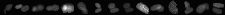

# TouchingNucleiDetection


Cleaned up codes from CellTK for python 3.  

Given segmentation, `calc_angle` calculates angle changes along each pixels on contours.  
For example, an object has a concave shape if it contains an angle change larger than 180. Such information can be used to detect touching objects.


```
python detect.py
```



